# Instrumento de Evaluación IOT Unidad 2.

## 1. Link de los 40 Videos de los sensores KY y MQ.

#### KY-001 Sensor de Temperatura

**Video**

[KY-001-SensorTemperatura](https://drive.google.com/file/d/1n1m2UdBV2cWrUkkIEG9vW55JPZdltURF/view?usp=drive_link)

**Código en el Repositorio**

- [KY-001 SensorTemperatura.py](codigoSensores/KY-001%20SensorTemperatura.py)

**Diagrama**

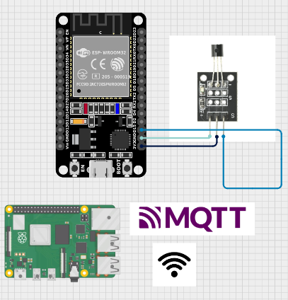

#### KY-002 Sensor de Vibración

**Video**

[KY-002-Sensor de vibración](https://drive.google.com/file/d/10F_IapyWUzlJ47bEoM1iVvSu4nLKC-jN/view?usp=drive_link)

**Código en el Repositorio**

- [KY-002 Sensor de vibración.py](codigoSensores/KY-002%20Sensor%20de%20vibración.py)

**Diagrama**

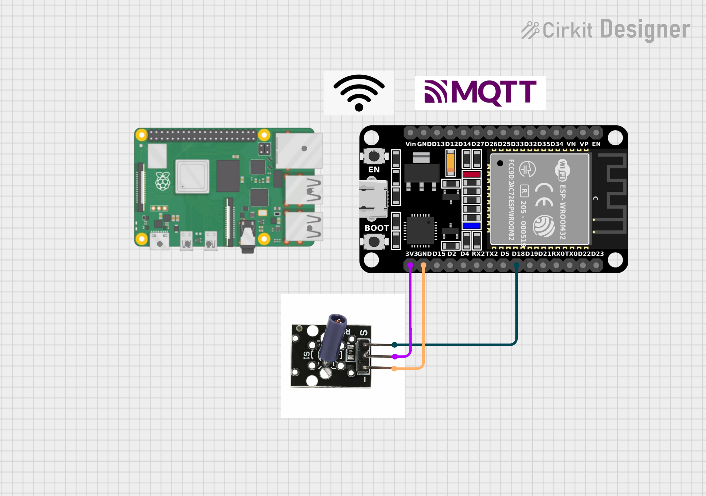

#### KY-003 Sensor Efecto Hall

**Video**

[KY-003 Sensor efecto hall](https://drive.google.com/file/d/1BcSnq5L0jVTkERnkd3txW-M6yrTuG1ie/view?usp=sharing)

**Código en el Repositorio**

- [KY-003 Sensor efecto hall.py](codigoSensores/KY-003%20Sensor%20efecto%20hall.py)

**Diagrama**

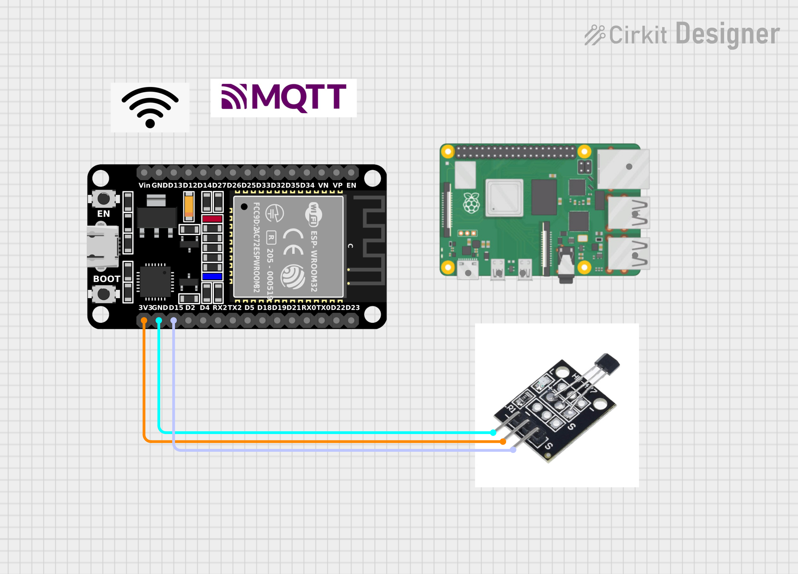

#### KY-004 Módulo Push Botón

**Video**

[KY-004 Modulo push boton](https://drive.google.com/file/d/1C2A--qEGxpIKWtZQsmDaQF9NMRgjaxO5/view?usp=sharing)

**Código en el Repositorio**

- [KY-004 ModuloPushBotón.py](codigoSensores/KY-004%20ModuloPushBoton.py)

**Diagrama**

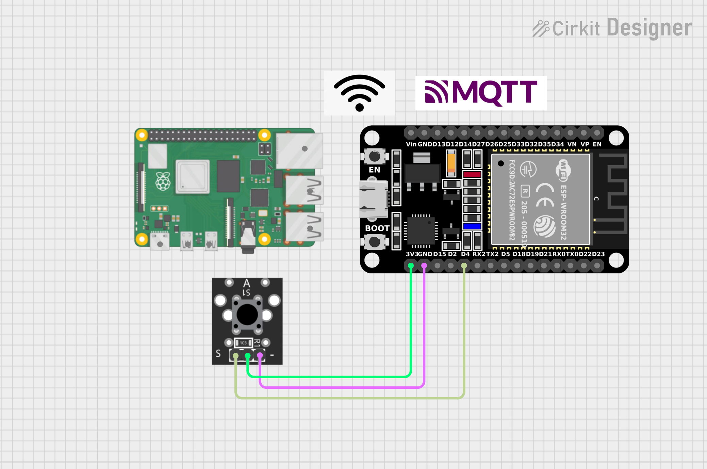

#### KY-005 Sensor Infrarrojo PIR

**Video**

[KY-005 Sensor infrarrojo PIR](https://drive.google.com/file/d/1BKUR2oZgUapGnjZWxOfSC0otHGGqyvYU/view?usp=sharing)

**Código en el Repositorio**

- [KY-005 Sensor infrarrojo PIR.py](codigoSensores/KY-005%20Sensor%20infrarrojo%20PIR.py)

**Diagrama**

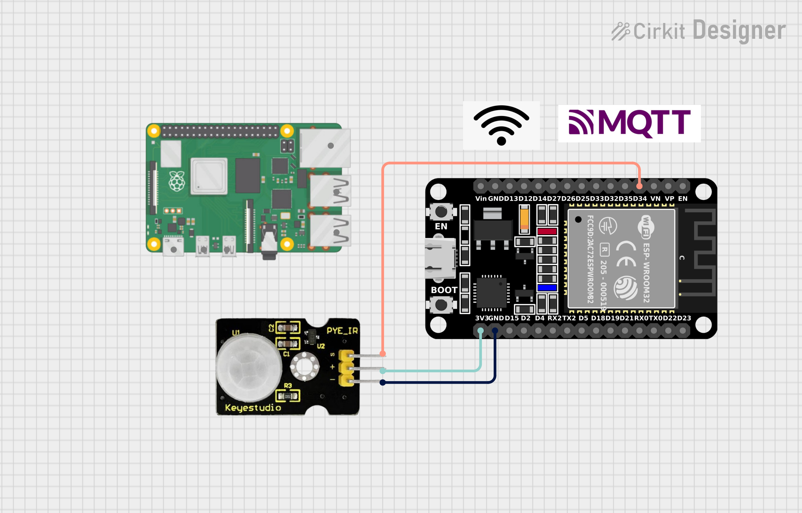

#### KY-006 Buzzer Pasivo

**Video**

[KY-006-BuzzerPasivo](https://drive.google.com/file/d/1StbI7UItz9Dt1ZnNiHiPNXbOJb9fWMuQ/view?usp=drive_link)

**Código en el Repositorio**

- [KY-006 Buzzer pasivo ABRAHAM.py](codigoSensores/KY-006%20Buzzer%20pasivo%20ABRAHAM.py)

**Diagrama**

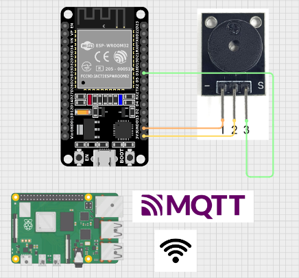

#### KY-008 Sensor Kaser

**Video**

[KY-008-SensorKaser](https://drive.google.com/file/d/1juocl0ywL8mHma32Jd4a31hybA40hxjh/view?usp=drive_link)

**Código en el Repositorio**

- [KY-008 ModuloLedLaser.py](codigoSensores/KY-008%20ModuloLedLaser.py)

**Diagrama**

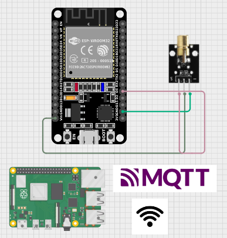

#### KY-010 Módulo Foto Interruptor

**Video**

[KY-010 Modulo foto interruptor](https://drive.google.com/file/d/1C0V4qze8Ud7-tTPG13Jp5owPjjWaechK/view?usp=sharing)

**Código en el Repositorio**

- [KY-010 Modulo foto interruptor.py](codigoSensores/KY-010%20Modulo%20foto%20interruptor.py)

**Diagrama**

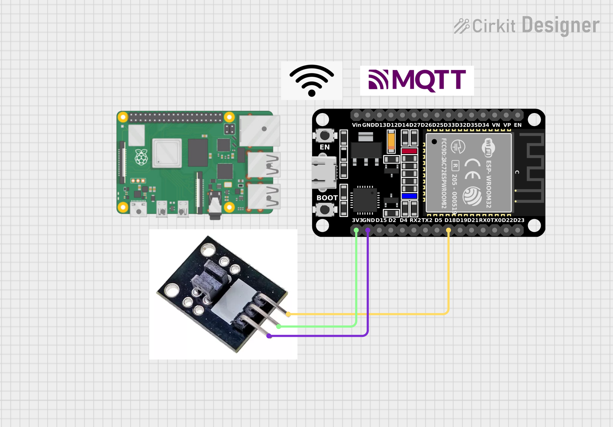

#### KY-011 Led 2 Colores

**Video**

[KY-011-Led-2-colores](https://drive.google.com/file/d/1UBRljiuOtjGGCbYI_E8LAgHZUpdgU-eN/view?usp=drive_link)

**Código en el Repositorio**

- [KY-011 Led2Colores.py](codigoSensores/KY-011%20Led2Colores.py)

**Diagrama**

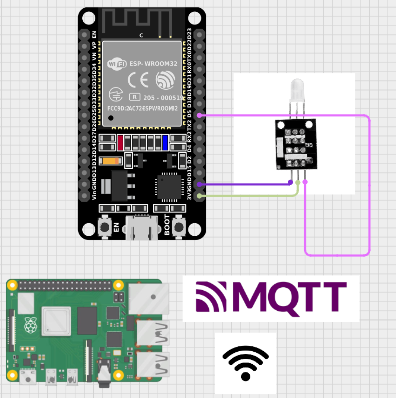

#### KY-012 Buzzer Activo

**Video**

[KY-012 Buzzer activo](https://drive.google.com/file/d/1Bdo6ewIa7_B8GKkziYfpNu7eNkKZaMEt/view?usp=sharing)

**Código en el Repositorio**

- [KY-012 Buzzer activo.py](codigoSensores/KY-012%20Buzzer%20activo.py)

**Diagrama**

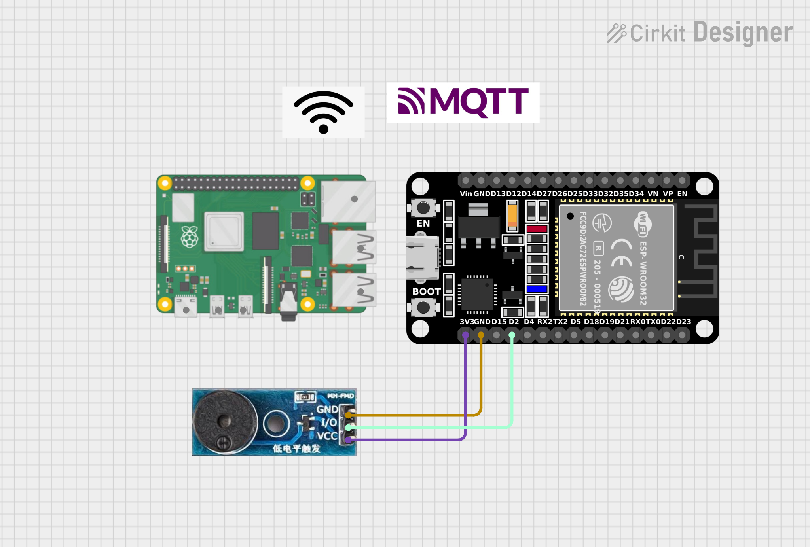

#### KY-016 Módulo Led RGB SMD

**Video**

[KY-016-LedRGB](https://drive.google.com/file/d/1vbiKbRzXu0EP-sPAcgwqsb1ZF-qlj0gC/view?usp=drive_link)

**Código en el Repositorio**

- [KY-016 Modulo led RGB SMD.py](codigoSensores/KY-016%20Modulo%20led%20RGB%20SMD.py)

**Diagrama**

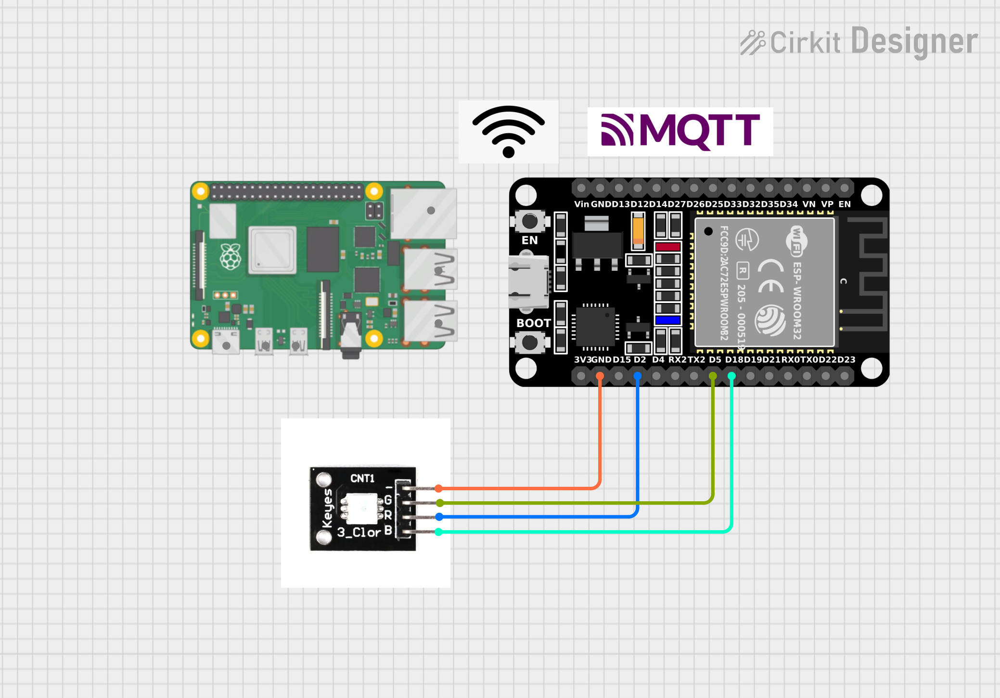

#### KY-017 Módulo Interruptor de Mercurio

**Video**

[KY-017 Modulo interruptor de mercurio](https://drive.google.com/file/d/1Bu-UnbnOK6FGSMVCdUIbk3sKQOywTvYr/view?usp=sharing)

**Código en el Repositorio**

- [KY-017 Modulo interruptor de mercurio.py](codigoSensores/KY-017%20Modulo%20interruptor%20de%20mercurio.py)

**Diagrama**

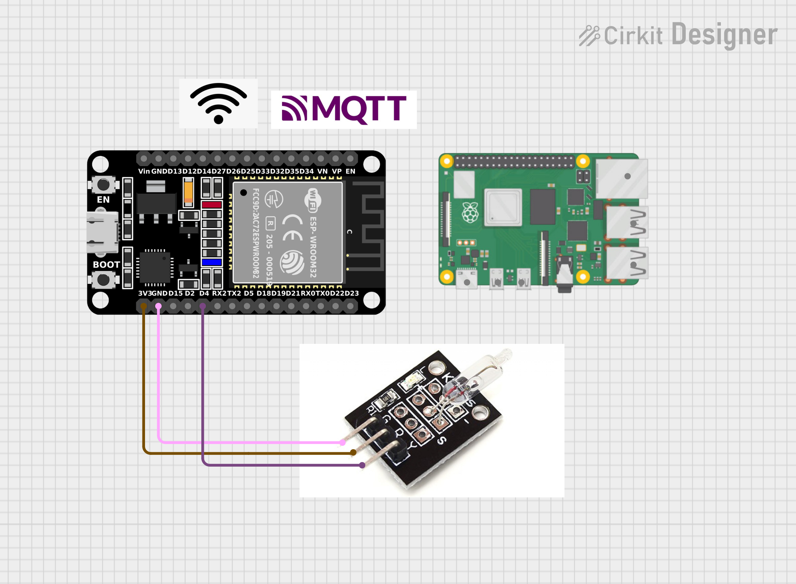

#### KY-018 Módulo Fotorresistencia

**Video**

[KY-018-ModuloFotorresistencia](https://drive.google.com/file/d/1XwcN_oqPxVoW8kMvbe8FGFBMgI666HR0/view?usp=drive_link)

**Código en el Repositorio**

- [KY-018 ModuloFotoresistencia.py](codigoSensores/KY-018%20ModuloFotoresistencia.py)

**Diagrama**

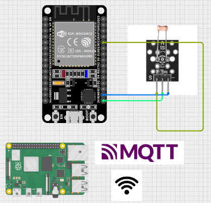

#### KY-020 Sensor de Inclinación

**Video**

[KY-020 Sensor de inclinacion](https://drive.google.com/file/d/1BE6zNcXXkhH0k5f7rM1uIACXmJL8QWmm/view?usp=sharing)

**Código en el Repositorio**

- [KY-020 Sensor de inclinación.py](codigoSensores/KY-020%20Sensor%20de%20inclinación.py)

**Diagrama**

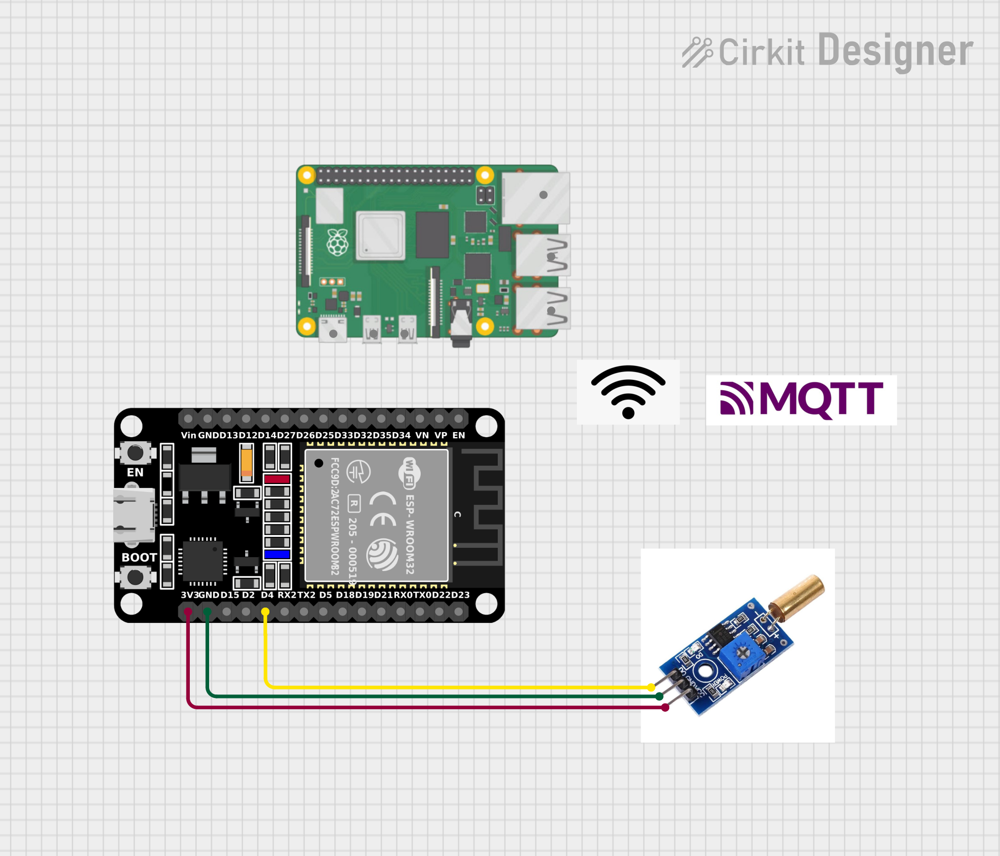

#### KY-021 Mini Interruptor Magnético

**Video**

[KY-021-MiniInterruptorMagnetico](https://drive.google.com/file/d/1FSK1EGpRSd89D-CXLNv5h38pRctCDaFd/view?usp=drive_link)

**Código en el Repositorio**

- [KY-021 Modulo mini interruptor magnético ABRAHAM.py](codigoSensores/KY-021%20Modulo%20mini%20interruptor%20magnético%20ABRAHAM.py)

**Diagrama**

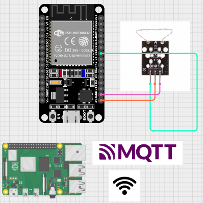

#### KY-022 Módulo Led Infrarrojo Receptor

**Video**

[KY-022 Modulo led infrarrojo receptor](https://drive.google.com/file/d/1BT8dtENiqoE6heV9kUUkLuW7R15oKdSd/view?usp=sharing)

**Código en el Repositorio**

- [KY-022 Modulo led infrarrojo receptor.py](codigoSensores/KY-022%20Modulo%20led%20infrarrojo%20receptor.py)

**Diagrama**

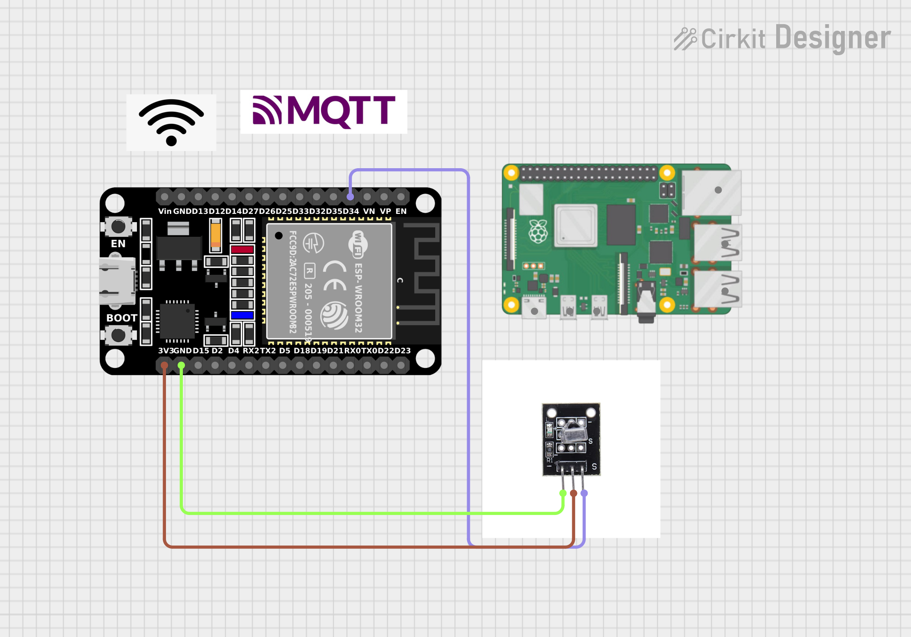

#### KY-023 Joystick

**Video**

[KY-023-Joystick](https://drive.google.com/file/d/14CGr2OLYs_V0xsG_scmBQase_yJJniXf/view?usp=drive_link)

**Código en el Repositorio**

- [KY-023 Modulo joystick ABRAHAM.py](codigoSensores/KY-023%20Modulo%20joystick%20ABRAHAM.py)

**Diagrama**

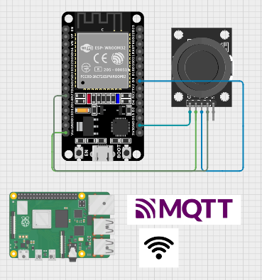

#### KY-024 Sensor Campo Magnético

**Video**

[KY-024-SensorCampoMagnetico](https://drive.google.com/file/d/1UmvIkVKwb_Saue_Spd9vv-gUPo-trIv6/view?usp=drive_link)

**Código en el Repositorio**

- [KY-024 Sensor campo magnético ABRAHAM.py](codigoSensores/KY-024%20Sensor%20campo%20magnético%20ABRAHAM.py)

**Diagrama**

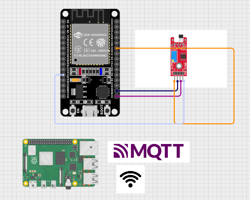

#### KY-026 Sensor Flama

**Video**

[KY-026-SensorFlama](https://drive.google.com/file/d/1pxDKgLpFEHLLm7L03ZIu2IExcIv-C-tM/view?usp=drive_link)

**Código en el Repositorio**

- [KY-026 SensorFlama.py](codigoSensores/KY-026%20SensorFlama.py)

**Diagrama**

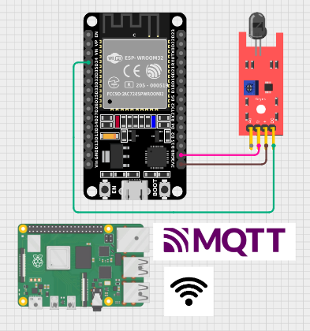

#### KY-027 Módulo Luminoso de Inclinación

**Video**

[KY-027-Modulo Luminoso de Inclinacion](https://drive.google.com/file/d/1KQHyc6oAALyhKOWl6g5aHXxxRhBiR_qz/view?usp=drive_link)

**Código en el Repositorio**

- [KY-027 ModuloLuminosoInclinacion.py](codigoSensores/KY-027%20ModuloLuminosoInclinacion.py)

**Diagrama**

#### KY-028 Sensor Temperatura Digital

**Video**

[KY-028-SensorTemperaturaDigital](https://drive.google.com/file/d/1ZV1MIl93gr0FPBqiQIAUGw2awsnn91nQ/view?usp=drive_link)

**Código en el Repositorio**

- [KY-028 SensorTemperaturaDigital.py](codigoSensores/KY-028%20SensorTemperaturaDigital.py)

**Diagrama**

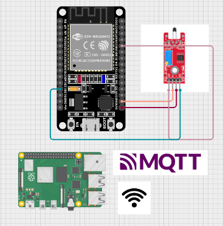

#### KY-031 Sensor Impacto

**Video**

[KY-031-SensorImpacto](https://drive.google.com/file/d/1-eJ8gLXFmfVqHhKcRYhKhiurmiH4EIiK/view?usp=drive_link)

**Código en el Repositorio**

- [KY-031 SensorImpacto.py](codigoSensores/KY-031%20SensorImpacto.py)

**Diagrama**

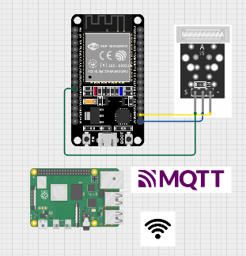

#### KY-032 Sensor Obstáculos

**Video**

[KY-032-SensorObstaculos](https://drive.google.com/file/d/1M6t22DneKAMxz66LLO2cHxhF5AF5Su0b/view?usp=drive_link)

**Código en el Repositorio**

- [KY-032 SensorObstaculos.py](codigoSensores/KY-032%20SensorObstaculos.py)

**Diagrama**

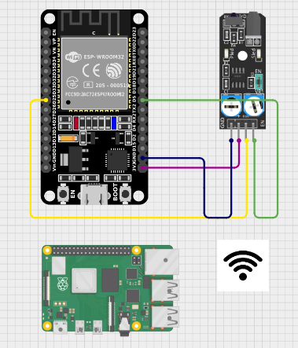

#### KY-033 Sensor de Línea

**Video**

[KY-033 Sensor de linea](https://drive.google.com/file/d/1BMebBgpf5SLwBD5quKEByJgYtKKhRYof/view?usp=sharing)

**Código en el Repositorio**

- [KY-033 Sensor de línea.py](codigoSensores/KY-033%20Sensor%20de%20línea.py)

**Diagrama**

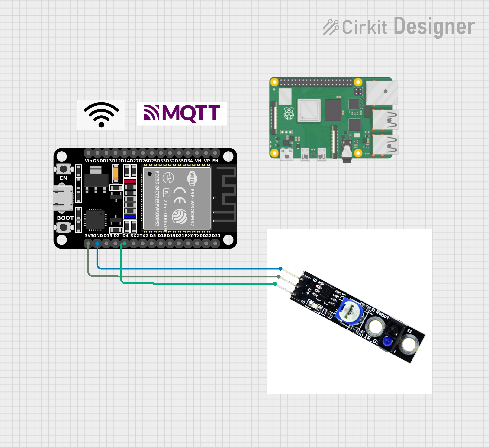

#### KY-034 Módulo Led 7 Colores

**Video**

[KY-034 Modulo led 7 colores](https://drive.google.com/file/d/1B6Fc_j_BhZM769KRp7DpkY0Uhh3GpN1r/view?usp=sharing)

**Código en el Repositorio**

- [KY-034.py](codigoSensores/KY-034.py)

**Diagrama**

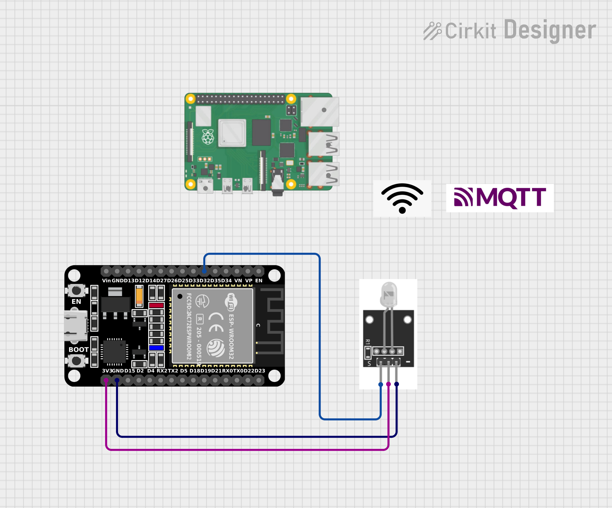

#### KY-035 Sensor Efecto Hall Analógico

**Video**

[KY-035  Sensor efecto hall analogo](https://drive.google.com/file/d/1BQ4LVTE5SXW7LlnxQzhXoOVbLBAJkWzm/view?usp=sharing)

**Código en el Repositorio**

- [KY-035 Sensor efecto hall analogo.py](codigoSensores/KY-035%20Sensor%20efecto%20hall%20analogo.py)

**Diagrama**

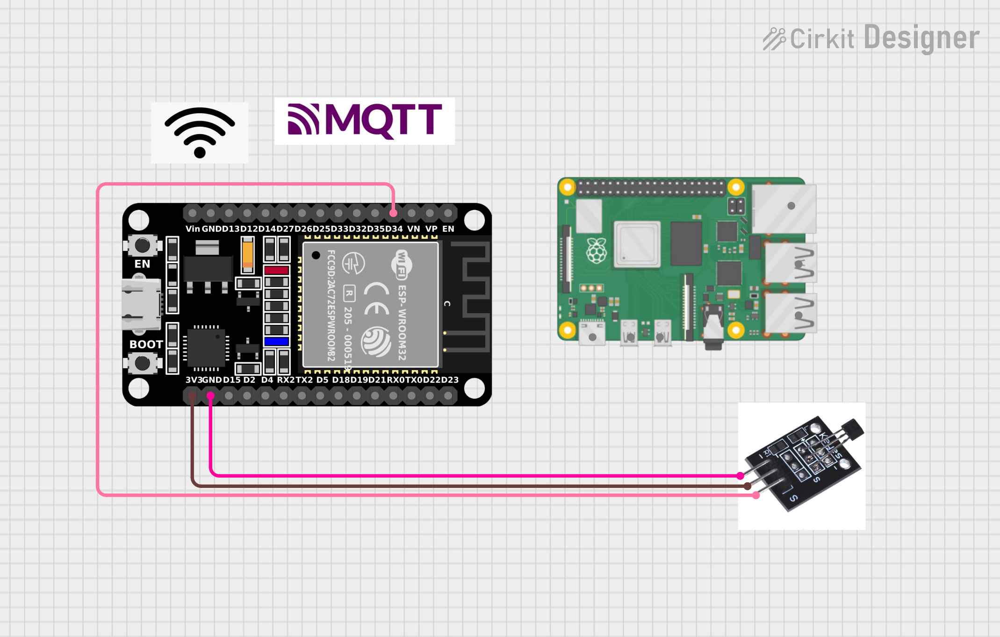

#### KY-036 Sensor Táctil de Metal

**Video**

[KY-036 Sensor tactil de metal](https://drive.google.com/file/d/1BPxhidLQcdRHR5EHGvE3R6Yl0EiOgEzO/view?usp=sharing)

**Código en el Repositorio**

- [KY-036 Tactil de metal.py](codigoSensores/KY-036%20Tactil%20de%20metal.py)

**Diagrama**

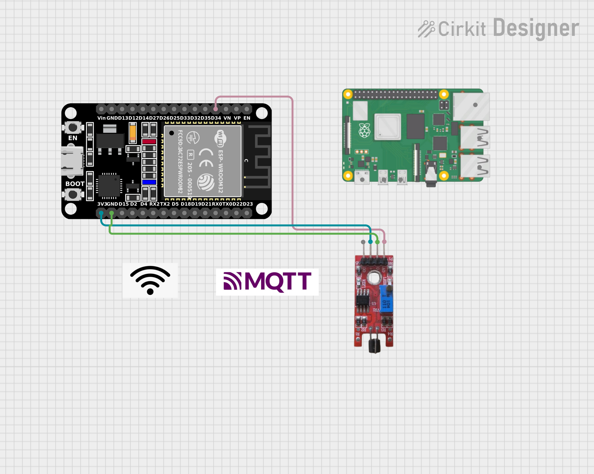

#### KY-037 Módulo Micrófono Sensible

**Video**

[KY-037-MicrofonoSensible](https://drive.google.com/file/d/1rJw87nfd9svLTpmrswbMn5Nu3qU72Xlu/view?usp=drive_link)

**Código en el Repositorio**

- [KY-037 ModuloMicrofonoSensible.py](codigoSensores/KY-037%20ModuloMicrofonoSensible.py)

**Diagrama**

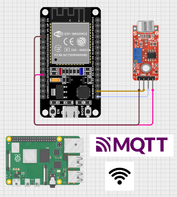

#### KY-038 Sensor Sonido con Micrófono

**Video**

[KY-038-Sensor Sonido con Microfono](https://drive.google.com/file/d/1XjBzKib-WXs5XESgJ5VNCIVp2kE7JfRb/view?usp=drive_link)

**Código en el Repositorio**

- [KY-038 SensorSonidoConMicrofono.py](codigoSensores/KY-038%20SensorSonidoConMicrofono.py)

**Diagrama**

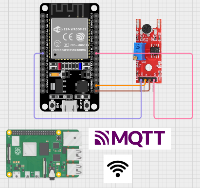

#### KY-039 Sensor Pulso

**Video**

[KY-039-SensorPulso](https://drive.google.com/file/d/10ndAcZ-1kXp77qLj78OGvDxzDoAAnqAL/view?usp=drive_link)

**Código en el Repositorio**

- [KY-039 SensorPulso.py](codigoSensores/KY-039%20SensorPulso.py)

**Diagrama**

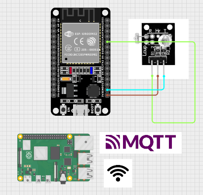

#### KY-040 Motor Vibrador

**Video**

[KY-040-MotorInclinacion](https://drive.google.com/file/d/1ErVGMYjQLwgCSeMSw_6Sdad3rKGeM6Xa/view?usp=drive_link)

**Código en el Repositorio**

- [KY-040 Motor Vibrador.py](codigoSensores/KY-040%20Motor%20Vibrador.py)

**Diagrama**

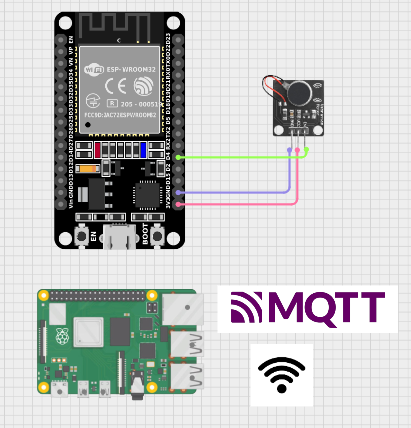

#### MQ-2

**Video**

[MQ-2](https://drive.google.com/file/d/1BcGS_WM8fwVtBKiOLcwvj0cvMmO0YC9b/view?usp=sharing)

**Código en el Repositorio**

- [MQ-2.py](codigoSensores/MQ-2.py)

**Diagrama**

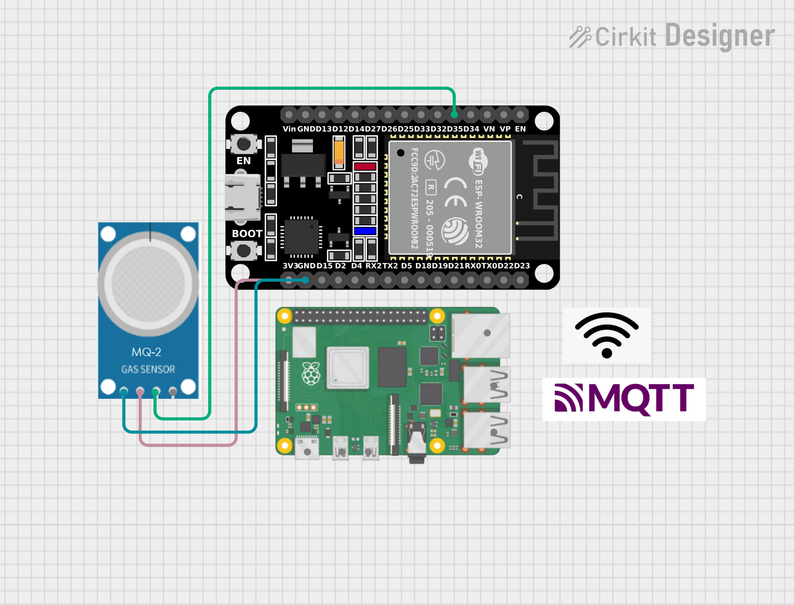

#### MQ-3

**Video**

[MQ-3](https://drive.google.com/file/d/1mDpsD70asEkLZfNefXnAvesBy3gwlrKq/view?usp=drive_link)

**Código en el Repositorio**

- [MQ-3.py](codigoSensores/MQ3.py)

**Diagrama**

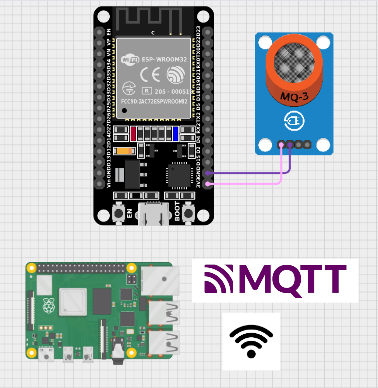

#### MQ-4

**Video**

[MQ-4](https://drive.google.com/file/d/1BaHU8N_U1vPLH86AjAGLKkGC5RfOj3YT/view?usp=sharing)

**Código en el Repositorio**

- [MQ-4.py](codigoSensores/MQ-4.py)

**Diagrama**

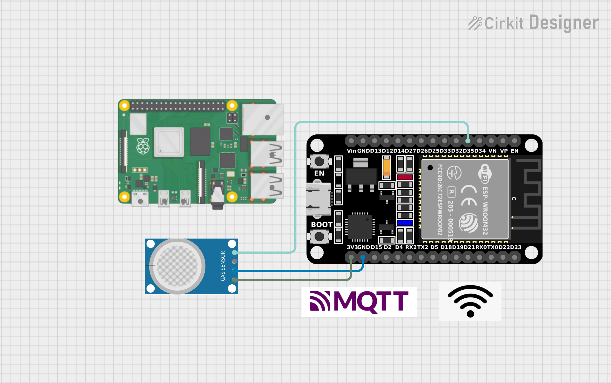

#### MQ-5

**Video**

[MQ-5](https://drive.google.com/file/d/1wOYunG3DxlGL-z_fLnqB_Rxkc5bn_QVV/view?usp=drive_link)

**Código en el Repositorio**

- [MQ-5.py](codigoSensores/MQ-5.py)

**Diagrama**

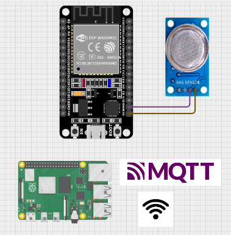

#### MQ-6

**Video**

[MQ-6](https://drive.google.com/file/d/1B_zvogDQGdpjrzHTcqv6ZkpyYRzsXiwf/view?usp=sharing)

**Código en el Repositorio**

- [MQ-6.py](codigoSensores/MQ-6.py)

**Diagrama**

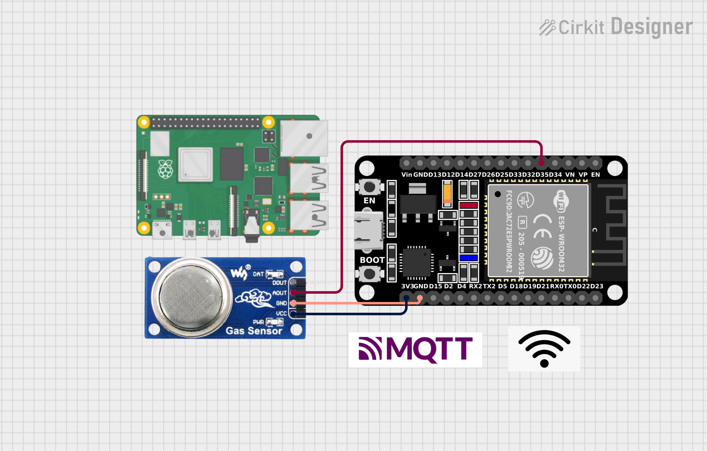

#### MQ-7

**Video**

[MQ-7](https://drive.google.com/file/d/1BWMI80wE82v_G3IDqzHukWUXQgmajxaQ/view?usp=sharing)

**Código en el Repositorio**

- [MQ-7.py](codigoSensores/MQ-7.py)

**Diagrama**

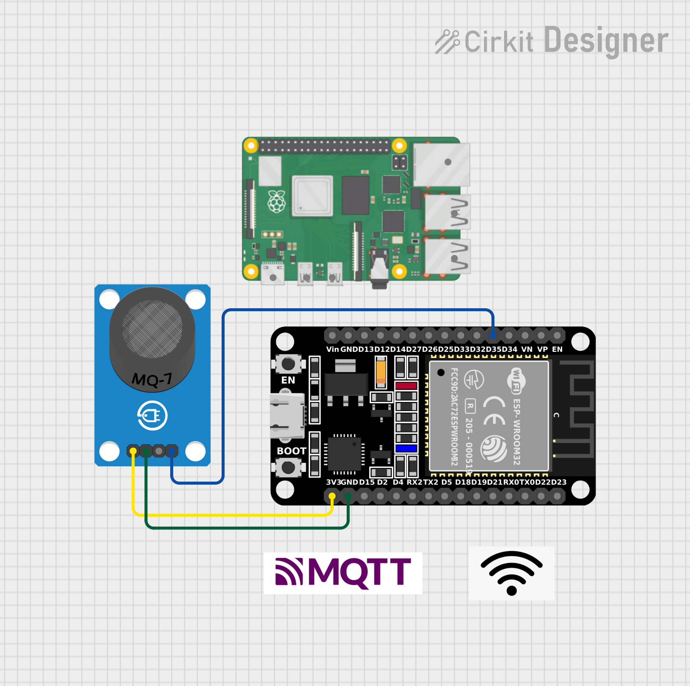

#### MQ-9

**Video**

[MQ-9](https://drive.google.com/file/d/1a1DQj9QRO99TRhQCWLrUUEklLETMaedj/view?usp=drive_link)

**Código en el Repositorio**

- [MQ-9.py](codigoSensores/MQ-9.py)

**Diagrama**

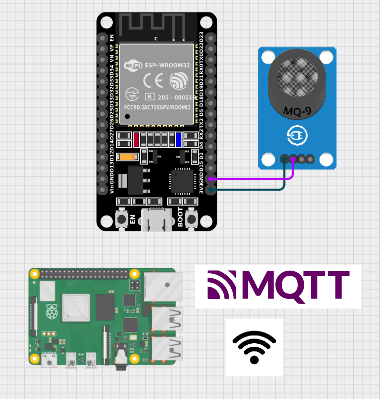

#### Sensor de Agua

**Video**

[Sensor de agua](https://drive.google.com/file/d/1C-I7tz3LnNJpOP9qtAL-Uok0r0uCZBrZ/view?usp=sharing)

**Código en el Repositorio**

- [Relevador.py](codigoSensores/Sensor%20del%20nivel%20de%20agua.py)

**Diagrama**

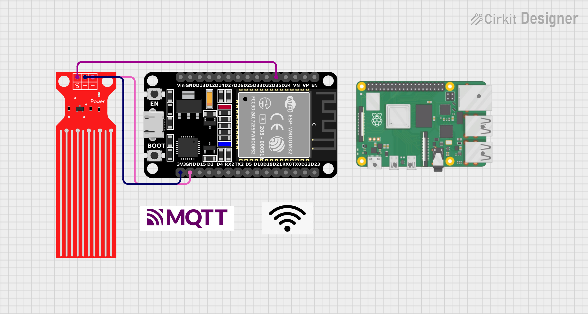

## 2. Ejercicio de Soldadura.

[Video del funcionamiento de los leds](https://drive.google.com/file/d/1m48G3qsEEqI4nA0dDuMwDTOxAH5Ay8s1/view?usp=drive_link)

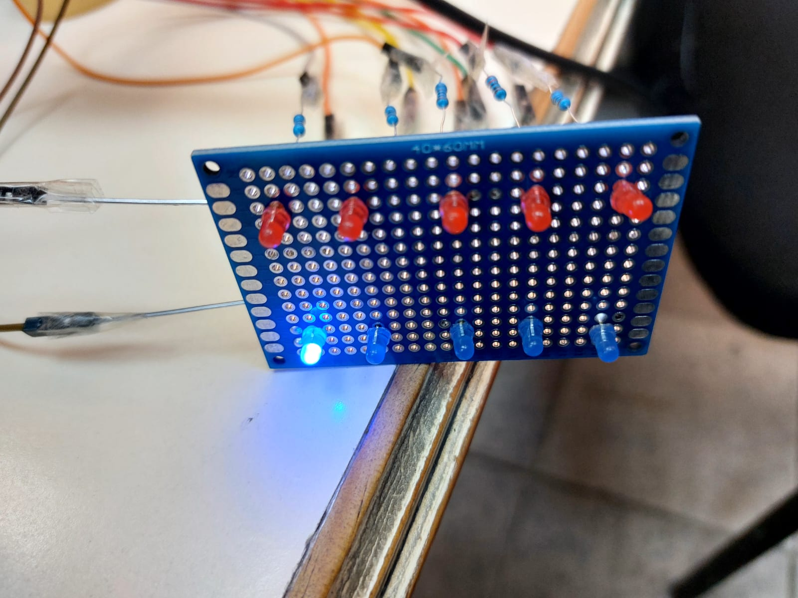

## 3. Quizziz.

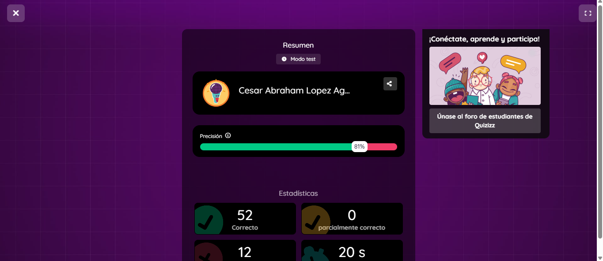

## 4. NetAcad.

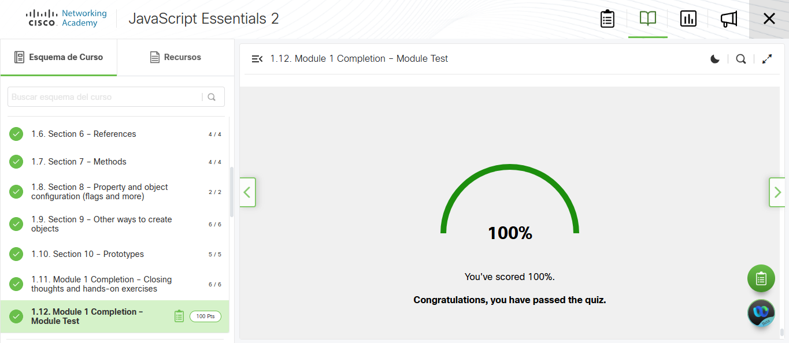
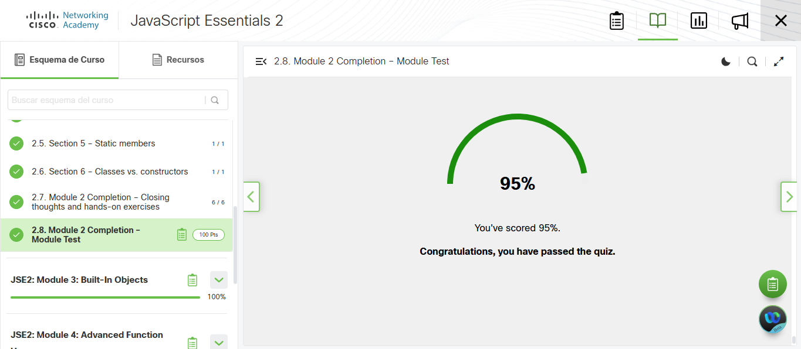
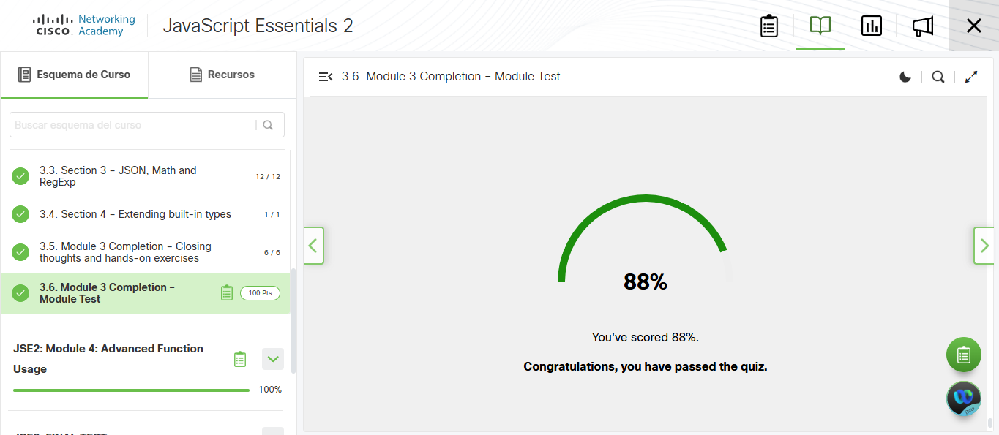
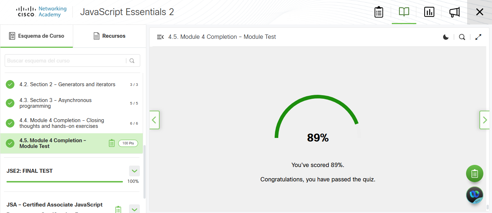

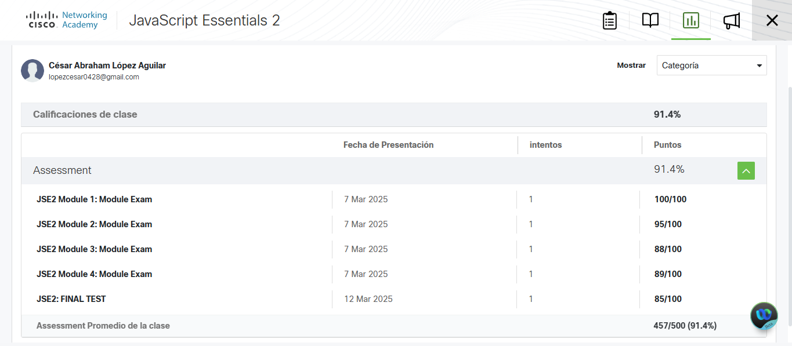

## Link Diagramas Cirkit Designer

[Enlace a los diagramas de Cirkit Designer](https://app.cirkitdesigner.com/project/b448c191-8eb2-48b2-863e-5185b4b2be68)

## Link Codigo Diagramas de Flujo Node-Red

[Enlace a los diagramas de Flujo de Node-Red](codigoFlujoNode-Red/)

## Breve Reflexión de lo aprendido en la unidad.

La realización de estos sensores ha sido una experiencia enriquecedora que me ha permitido profundizar en el mundo de la electrónica y la programación. A través de la construcción y programación de cada sensor, he adquirido habilidades en el manejo de componentes electrónicos y en la implementación de código para controlarlos.

He aprendido a utilizar diferentes tipos de sensores, desde los más básicos como el sensor de temperatura y el sensor de vibración, hasta los más complejos como el sensor de efecto Hall y el módulo de joystick. Cada sensor ha presentado sus propios desafíos y oportunidades de aprendizaje, permitiéndome comprender mejor cómo funcionan y cómo pueden ser aplicados en proyectos prácticos.

Además, he mejorado mis habilidades en la resolución de problemas y en la depuración de código, lo cual es esencial en cualquier proyecto de programación. La integración de los sensores con el código ha sido un proceso iterativo que me ha enseñado la importancia de la precisión y la atención al detalle.

En esencia, este proyecto ha sido una excelente oportunidad para aplicar conocimientos teóricos en un contexto práctico, y me ha motivado a seguir aprendiendo en el campo de la electrónica sobre todo quiero aprender a soldar de forma profecional.
