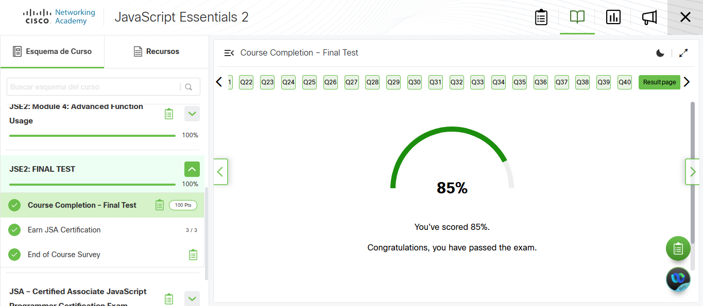

# Instrumento de Evaluación IOT Unidad 2.

## 1. Link de los 40 Videos de los sensores KY y MQ.

1. [KY-001-SensorTemperatura](https://drive.google.com/file/d/1n1m2UdBV2cWrUkkIEG9vW55JPZdltURF/view?usp=drive_link)
2. [KY-002-Sensor de vibración](https://drive.google.com/file/d/10F_IapyWUzlJ47bEoM1iVvSu4nLKC-jN/view?usp=drive_link)
3. [KY-006-BuzzerPasivo](https://drive.google.com/file/d/1StbI7UItz9Dt1ZnNiHiPNXbOJb9fWMuQ/view?usp=drive_link)
4. [KY-008-SensorKaser](https://drive.google.com/file/d/1juocl0ywL8mHma32Jd4a31hybA40hxjh/view?usp=drive_link)
5. [KY-011-Led-2-colores](https://drive.google.com/file/d/1UBRljiuOtjGGCbYI_E8LAgHZUpdgU-eN/view?usp=drive_link)
6. [KY-016-LedRGB](https://drive.google.com/file/d/1vbiKbRzXu0EP-sPAcgwqsb1ZF-qlj0gC/view?usp=drive_link)
7. [KY-018-ModuloFotorresistencia](https://drive.google.com/file/d/1XwcN_oqPxVoW8kMvbe8FGFBMgI666HR0/view?usp=drive_link)
8. [KY-021-MiniInterruptorMagnetico](https://drive.google.com/file/d/1FSK1EGpRSd89D-CXLNv5h38pRctCDaFd/view?usp=drive_link)
9. [KY-023-Joystick](https://drive.google.com/file/d/14CGr2OLYs_V0xsG_scmBQase_yJJniXf/view?usp=drive_link)
10. [KY-024-SensorCampoMagnetico](https://drive.google.com/file/d/1UmvIkVKwb_Saue_Spd9vv-gUPo-trIv6/view?usp=drive_link)
10. [KY-026-SensorFlama](https://drive.google.com/file/d/1pxDKgLpFEHLLm7L03ZIu2IExcIv-C-tM/view?usp=drive_link)
11. [KY-027-Modulo Luminoso de Inclinacion](https://drive.google.com/file/d/1KQHyc6oAALyhKOWl6g5aHXxxRhBiR_qz/view?usp=drive_link)
12. [KY-028-SensorTemperaturaDigital](https://drive.google.com/file/d/1ZV1MIl93gr0FPBqiQIAUGw2awsnn91nQ/view?usp=drive_link)
13. [KY-031-SensorImpacto](https://drive.google.com/file/d/1-eJ8gLXFmfVqHhKcRYhKhiurmiH4EIiK/view?usp=drive_link)
14. [KY-032-SensorObstaculos](https://drive.google.com/file/d/1M6t22DneKAMxz66LLO2cHxhF5AF5Su0b/view?usp=drive_link)
15. [KY-037-MicrofonoSensible](https://drive.google.com/file/d/1rJw87nfd9svLTpmrswbMn5Nu3qU72Xlu/view?usp=drive_link)
16. [KY-038-Sensor Sonido con Microfono](https://drive.google.com/file/d/1XjBzKib-WXs5XESgJ5VNCIVp2kE7JfRb/view?usp=drive_link)
17. [KY-039-SensorPulso](https://drive.google.com/file/d/10ndAcZ-1kXp77qLj78OGvDxzDoAAnqAL/view?usp=drive_link)
18. [KY-040-MotorInclinacion](https://drive.google.com/file/d/1ErVGMYjQLwgCSeMSw_6Sdad3rKGeM6Xa/view?usp=drive_link)
19. [MQ3](https://drive.google.com/file/d/1mDpsD70asEkLZfNefXnAvesBy3gwlrKq/view?usp=drive_link)
20. [MQ5](https://drive.google.com/file/d/1wOYunG3DxlGL-z_fLnqB_Rxkc5bn_QVV/view?usp=drive_link)
21. [MQ9](https://drive.google.com/file/d/1a1DQj9QRO99TRhQCWLrUUEklLETMaedj/view?usp=drive_link)

## 2. Ejercicio de Soldadura.

[Video del funcionamiento de los leds](https://drive.google.com/file/d/1m48G3qsEEqI4nA0dDuMwDTOxAH5Ay8s1/view?usp=drive_link)

## 3. Quizziz.

## 4. NetAcad.

## 5.

# Enlaces a archivos en la carpeta `codigoSensores`

- [KY-004 ModuloPushBotón.py](codigoSensores/KY-004%20ModuloPushBoton.py)
- [KY-008 ModuloLedLaser.py](codigoSensores/KY-008%20ModuloLedLaser.py)
- [KY-011 Led2Colores.py](codigoSensores/KY-011%20Led2Colores.py)
- [KY-018 ModuloFotoresistencia.py](codigoSensores/KY-018%20ModuloFotoresistencia.py)
- [KY-026 SensorFlama.py](codigoSensores/KY-026%20SensorFlama.py)
- [KY-027 ModuloLuminosoInclinacion.py](codigoSensores/KY-027%20ModuloLuminosoInclinacion.py)
- [KY-028 SensorTemperaturaDigital.py](codigoSensores/KY-028%20SensorTemperaturaDigital.py)
- [KY-031 SensorImpacto.py](codigoSensores/KY-031%20SensorImpacto.py)
- [KY-032 SensorObstaculos.py](codigoSensores/KY-032%20SensorObstaculos.py)
- [KY-037 ModuloMicrofonoSensible.py](codigoSensores/KY-037%20ModuloMicrofonoSensible.py)
- [KY-038 SensorSonidoConMicrofono.py](codigoSensores/KY-038%20SensorSonidoConMicrofono.py)
- [KY-039 SensorPulso.py](codigoSensores/KY-039%20SensorPulso.py)
- [KY-040 Motor Vibrador.py](codigoSensores/KY-040%20Motor%20Vibrador.py)
- [MQ-5.py](codigoSensores/MQ-5.py)
- [MQ3.py](codigoSensores/MQ3.py)
